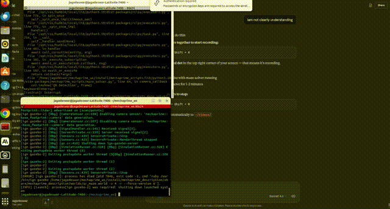
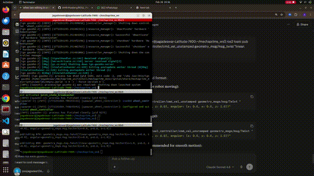
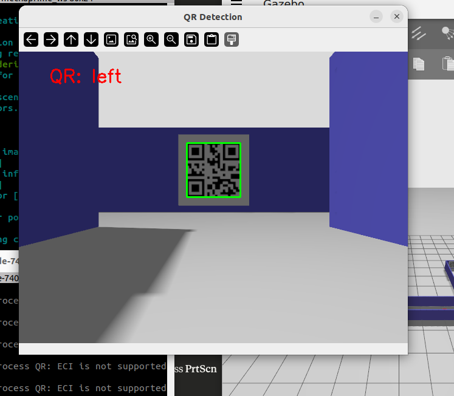
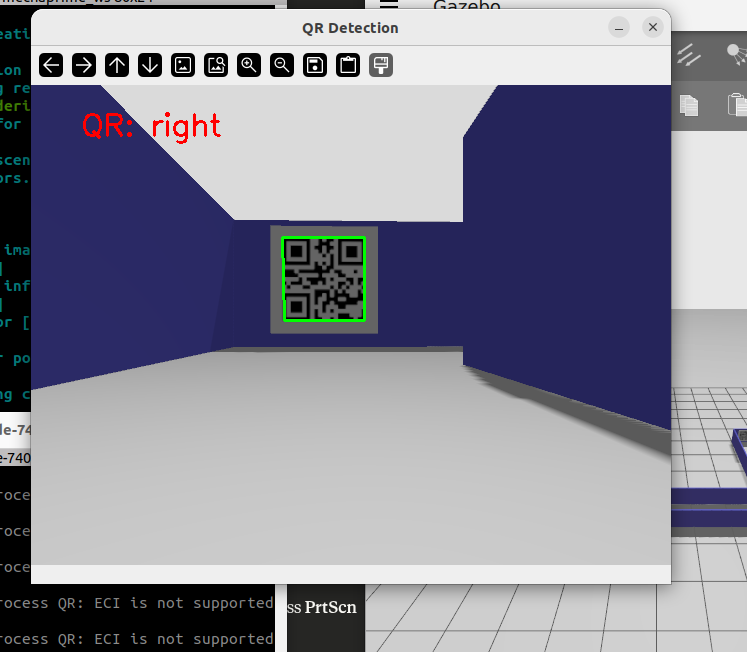
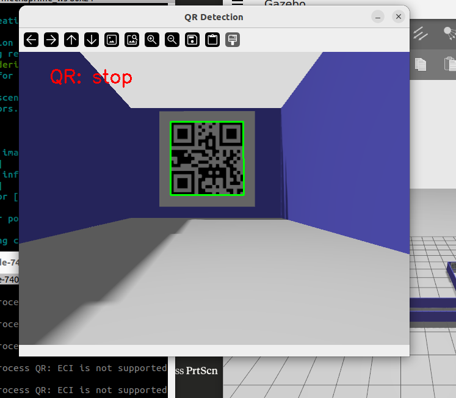
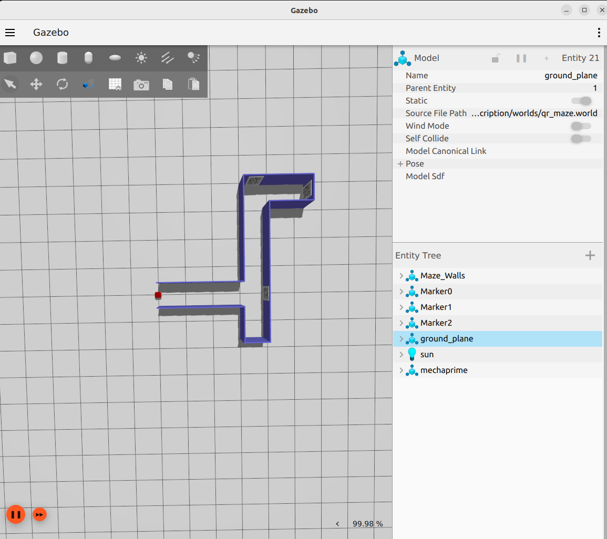
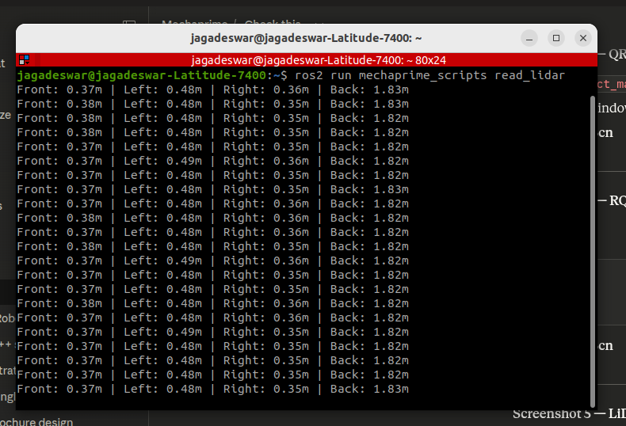
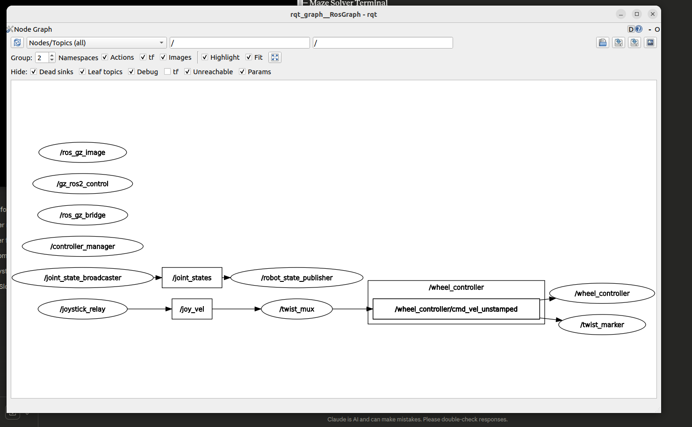
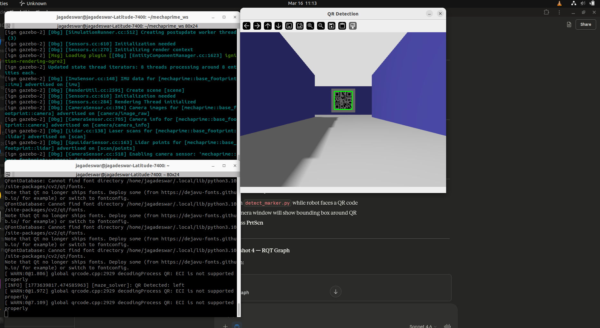

# 🤖 MechaPrime — Autonomous Mobile Robot (ROS2 + Ignition Gazebo)

[](https://docs.ros.org/en/humble/)
[](https://gazebosim.org/)
[](https://www.python.org/)
[](LICENSE)
[](https://github.com/robovision2210/mechaprime_ws)

> A differential drive autonomous mobile robot simulated in ROS2 Humble + Ignition Gazebo 6, featuring QR-code-guided maze navigation, LiDAR-based obstacle avoidance, IMU feedback, and camera-based marker detection.

---

## 🎥 Demos

### 🧠 Autonomous Maze Solver


### 🕹️ Teleoperation


---

## 📸 Screenshots

| QR: Left | QR: Right | QR: Stop |
|----------|-----------|----------|
|  |  |  |

| Maze Top View | LiDAR Output | RQT Node Graph |
|---------------|--------------|----------------|
|  |  |  |

| Maze Solver Terminal |
|----------------------|
|  |

---

## 🧠 Features

- **Autonomous Maze Navigation** — State machine (FORWARD → TURNING → STOPPED) driven by LiDAR + QR codes
- **QR Code Detection** — OpenCV-based QR decoder reads directional commands (`left`, `right`, `stop`)
- **LiDAR Obstacle Avoidance** — 360° LiDAR scan with front threshold detection (0.45m)
- **IMU-based Turning** — Precise 90° turns using yaw feedback from IMU
- **Differential Drive Control** — ros2_control with DiffDriveController via twist_mux priority pipeline
- **Joystick Teleoperation** — Override autonomous mode with PS4/Xbox controller (priority 99)
- **Keyboard Teleoperation** — Manual control via teleop_twist_keyboard

---

## 🏗️ Robot Specifications

| Parameter | Value |
|-----------|-------|
| Drive Type | Differential Drive |
| Wheel Separation | 0.185 m |
| Wheel Radius | 0.034 m |
| Base Mass | 5 kg |
| Max Linear Velocity | 2.0 m/s |
| Max Angular Velocity | 2.5 rad/s |

### Sensors

| Sensor | Type | Topic | Rate |
|--------|------|--------|------|
| LiDAR | 360° GPU Ray | `/scan` | 5 Hz |
| IMU | 6-DOF | `/imu/out` | 100 Hz |
| Camera | RGB 640×480 | `/camera/image_raw` | 10 Hz |

---

## 📦 Package Structure

```
mechaprime_ws/src/
├── mechaprime_description/     # URDF xacro, meshes, Gazebo launch, worlds
├── mechaprime_controller/      # ros2_control, diff_drive, twist_mux configs
├── mechaprime_bringup/         # Full system bringup launch
└── mechaprime_scripts/         # Python sensor + autonomy nodes
```

---

## 🔧 Dependencies

- ROS2 Humble
- Ignition Gazebo 6 (Harmonic)
- Python 3.10
- OpenCV (`cv2`)
- `ros_gz_sim`, `ros_gz_bridge`
- `ros2_control`, `diff_drive_controller`
- `twist_mux`, `joy_teleop`

---

## 🚀 Installation

```bash
# Clone the repository
git clone https://github.com/robovision2210/mechaprime_ws.git
cd mechaprime_ws

# Install dependencies
rosdep install --from-paths src --ignore-src -r -y

# Build
colcon build
source install/setup.bash
```

---

## ▶️ Running the Simulation

### Launch Gazebo + Robot

```bash
# Terminal 1 — Full simulation (Gazebo + joystick + twist_mux)
ros2 launch mechaprime_bringup simulated_robot.launch.py
```

### Run Maze Solver (Autonomous)

```bash
# Terminal 2 — Autonomous QR maze navigation
ros2 run mechaprime_scripts maze_solver
```

### Manual Control (Keyboard)

```bash
# Terminal 3 — Keyboard teleoperation
ros2 run teleop_twist_keyboard teleop_twist_keyboard --ros-args -r cmd_vel:=/key_vel
```

---

## 🗺️ Available Worlds

| World | Description |
|-------|-------------|
| `empty.world` | Empty world for testing |
| `qr_maze.world` | QR-code guided maze with 3 markers |
| `small_house.world` | Indoor navigation environment |

```bash
# Launch with specific world
ros2 launch mechaprime_description gazebo.launch.py world_name:=qr_maze
```

---

## 🐍 Python Nodes

| Node | Description | Topics |
|------|-------------|--------|
| `maze_solver` | Autonomous QR maze navigation state machine | `/scan`, `/imu/out`, `/camera/image_raw` → `/cmd_vel` |
| `detect_marker` | QR code detection with bounding box visualization | `/camera/image_raw` |
| `read_lidar` | 4-quadrant LiDAR distance reader | `/scan` |
| `read_imu` | Yaw angle and yaw rate from IMU | `/imu/out` |
| `read_camera` | Live camera feed viewer | `/camera/image_raw` |

---

## 🔀 Velocity Pipeline

```
joystick (priority 99) ─┐
navigation (priority 90) ┼─► twist_mux ──► /wheel_controller/cmd_vel_unstamped ──► robot
keyboard   (priority 80) ┘
```

---

## 🕹️ RQT Node Graph


---

## 📡 Key ROS2 Topics

| Topic | Type | Description |
|-------|------|-------------|
| `/scan` | `sensor_msgs/LaserScan` | LiDAR scan data |
| `/imu/out` | `sensor_msgs/Imu` | IMU data |
| `/camera/image_raw` | `sensor_msgs/Image` | Camera feed |
| `/cmd_vel` | `geometry_msgs/Twist` | Velocity command input |
| `/wheel_controller/cmd_vel_unstamped` | `geometry_msgs/Twist` | Final wheel command |
| `/joint_states` | `sensor_msgs/JointState` | Wheel joint states |

---

## 🏛️ Maze Solver State Machine

```
┌─────────────┐    obstacle detected     ┌─────────────┐
│   FORWARD   │ ──────────────────────► │   TURNING   │
│  (0.15 m/s) │                          │ (0.3 rad/s) │
└─────────────┘ ◄─────────────────────── └─────────────┘
       │           turn complete (IMU)
       │ QR: "stop"
       ▼
┌─────────────┐
│   STOPPED   │
└─────────────┘
```

**QR Commands:**
- `left` → Turn left 90°
- `right` → Turn right 90°
- `stop` → Stop robot permanently

---

## 👨‍💻 Author

**Sesha Sai Jagadeswar Patnala**  
Robotics & Mechatronics Engineer  
[](https://github.com/robovision2210)

---

## 📄 License

This project is licensed under the MIT License — see the [LICENSE](LICENSE) file for details.
